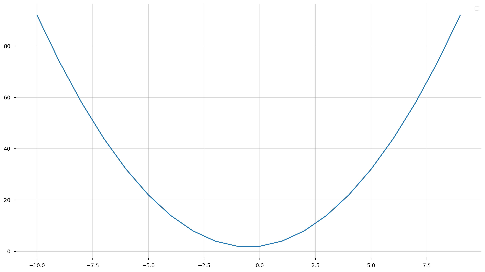
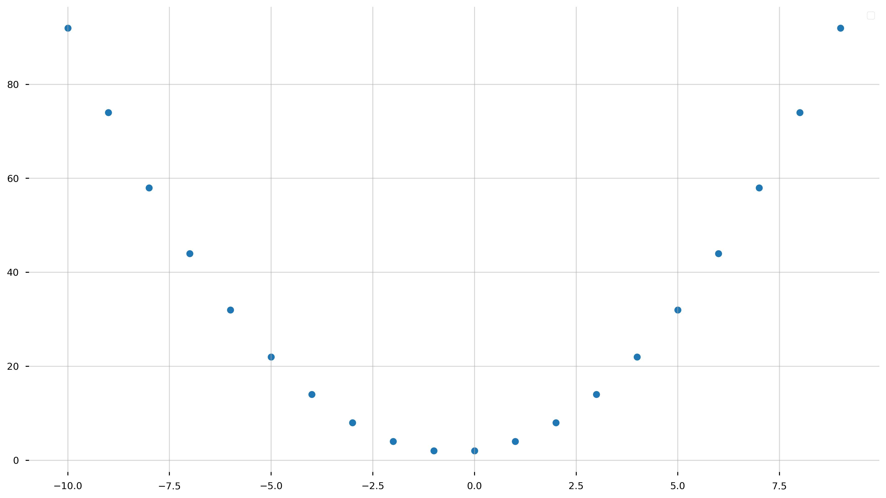
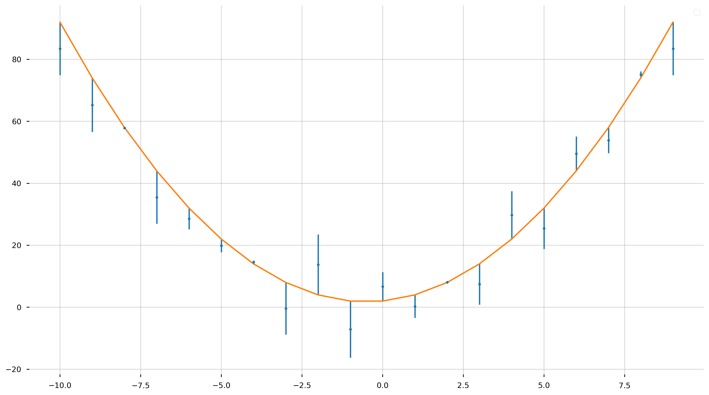
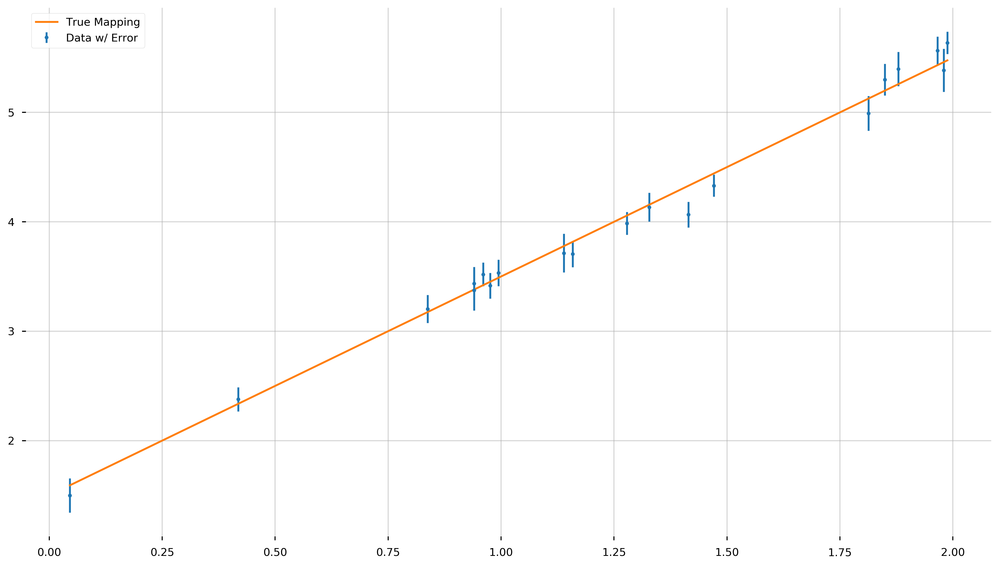

## What is Numpy?

[NumPy](http://www.numpy.org/) is an incredibly powerful module and a foundation of scientific computing in Python. It provides a high-performance multidimensional array object, and tools for working with these arrays.


```python
# Import the numpy module and assign the alias np
import numpy as np
```

### What is an array?

A numpy array is a grid of values, all of the same type, and is indexed by a tuple of nonnegative integers. The number of dimensions is the rank of the array; the shape of an array is a tuple of integers giving the size of the array along each dimension.

We can initialize numpy arrays from nested Python lists, and access elements using square brackets. Here we generate rank 1 array, a, with elements 1,2,3. Think of it as nothing more than a list with built-in methods.


```python
a = np.array([1, 2, 3])
print(type(a))
print(a.shape)
print(a[0], a[1], a[2])
a[0] = 5
print(a)
```

    <class 'numpy.ndarray'>
    (3,)
    1 2 3
    [5 2 3]


```python
? a
```


    Type:            ndarray
    String form:     [5 2 3]
    Length:          3
    File:            ~/miniconda3/envs/datasci/lib/python3.7/site-packages/numpy/__init__.py
    Docstring:       <no docstring>
    Class docstring:
    ndarray(shape, dtype=float, buffer=None, offset=0,
            strides=None, order=None)
    
    An array object represents a multidimensional, homogeneous array
    of fixed-size items.  An associated data-type object describes the
    format of each element in the array (its byte-order, how many bytes it
    occupies in memory, whether it is an integer, a floating point number,
    or something else, etc.)
    
    Arrays should be constructed using `array`, `zeros` or `empty` (refer
    to the See Also section below).  The parameters given here refer to
    a low-level method (`ndarray(...)`) for instantiating an array.
    
    For more information, refer to the `numpy` module and examine the
    methods and attributes of an array.
    
    Parameters
    ----------
    (for the __new__ method; see Notes below)
    
    shape : tuple of ints
        Shape of created array.
    dtype : data-type, optional
        Any object that can be interpreted as a numpy data type.
    buffer : object exposing buffer interface, optional
        Used to fill the array with data.
    offset : int, optional
        Offset of array data in buffer.
    strides : tuple of ints, optional
        Strides of data in memory.
    order : {'C', 'F'}, optional
        Row-major (C-style) or column-major (Fortran-style) order.
    
    Attributes
    ----------
    T : ndarray
        Transpose of the array.
    data : buffer
        The array's elements, in memory.
    dtype : dtype object
        Describes the format of the elements in the array.
    flags : dict
        Dictionary containing information related to memory use, e.g.,
        'C_CONTIGUOUS', 'OWNDATA', 'WRITEABLE', etc.
    flat : numpy.flatiter object
        Flattened version of the array as an iterator.  The iterator
        allows assignments, e.g., ``x.flat = 3`` (See `ndarray.flat` for
        assignment examples; TODO).
    imag : ndarray
        Imaginary part of the array.
    real : ndarray
        Real part of the array.
    size : int
        Number of elements in the array.
    itemsize : int
        The memory use of each array element in bytes.
    nbytes : int
        The total number of bytes required to store the array data,
        i.e., ``itemsize * size``.
    ndim : int
        The array's number of dimensions.
    shape : tuple of ints
        Shape of the array.
    strides : tuple of ints
        The step-size required to move from one element to the next in
        memory. For example, a contiguous ``(3, 4)`` array of type
        ``int16`` in C-order has strides ``(8, 2)``.  This implies that
        to move from element to element in memory requires jumps of 2 bytes.
        To move from row-to-row, one needs to jump 8 bytes at a time
        (``2 * 4``).
    ctypes : ctypes object
        Class containing properties of the array needed for interaction
        with ctypes.
    base : ndarray
        If the array is a view into another array, that array is its `base`
        (unless that array is also a view).  The `base` array is where the
        array data is actually stored.
    
    See Also
    --------
    array : Construct an array.
    zeros : Create an array, each element of which is zero.
    empty : Create an array, but leave its allocated memory unchanged (i.e.,
            it contains "garbage").
    dtype : Create a data-type.
    
    Notes
    -----
    There are two modes of creating an array using ``__new__``:
    
    1. If `buffer` is None, then only `shape`, `dtype`, and `order`
       are used.
    2. If `buffer` is an object exposing the buffer interface, then
       all keywords are interpreted.
    
    No ``__init__`` method is needed because the array is fully initialized
    after the ``__new__`` method.
    
    Examples
    --------
    These examples illustrate the low-level `ndarray` constructor.  Refer
    to the `See Also` section above for easier ways of constructing an
    ndarray.
    
    First mode, `buffer` is None:
    
    >>> np.ndarray(shape=(2,2), dtype=float, order='F')
    array([[ -1.13698227e+002,   4.25087011e-303],
           [  2.88528414e-306,   3.27025015e-309]])         #random
    
    Second mode:
    
    >>> np.ndarray((2,), buffer=np.array([1,2,3]),
    ...            offset=np.int_().itemsize,
    ...            dtype=int) # offset = 1*itemsize, i.e. skip first element
    array([2, 3])


What if we want to extend this to a higher dimension? It's easy! Let us create a 2x3 dimensional array.


```python
b = np.array([[1,2,3],[4,5,6]])
print(b)
print(b.shape)
print(b[0, 0], b[0, 1], b[1, 0])
```

    [[1 2 3]
     [4 5 6]]
    (2, 3)
    1 2 4


### More on Array Indexing and Slicing

A powerful feature of arrays (and lists) is array indexing and slicing, which allows us to access individual elements, or subsets, of an array.


```python
b = np.array([[1,2,3],[4,5,6]])
print(b[0]) # first row
print(b[0,0]) # first entry of the first row
print(b[0, 1:]) #first row, entries after "1"th position
print(b[1, 1:-1]) #second row, "1"th element to the penultimate.
```

    [1 2 3]
    1
    [2 3]
    [5]


### Boolean Indexing

Boolean array indexing lets you pick out arbitrary elements of an array. Frequently this type of indexing is used to select the elements of an array that satisfy some condition. Here is an example:


```python
print(b[b > 2]) # elements of b where are greater than 2
print(b[b != 5]) # elements of b not equal to 5
```

    [3 4 5 6]
    [1 2 3 4 6]


#### Exercise

1) Create the following array:
```python
 [[ 1  2  3  4]
  [ 5  6  7  8]
  [ 9 10 11 12]]
```
2) Return the "Rank 1" and "Rank 2" views of the second row. Additionally, return their shapes.

3) Repeat for a column of your choice.

#### Exercise Solution


```python
# (1)
a = np.array([[1,2,3,4], [5,6,7,8], [9,10,11,12]])

# (2)
row_r1 = a[1, :]
row_r2 = a[1:2, :]
print(row_r1, row_r1.shape)
print(row_r2, row_r2.shape)

# (3)
col_r1 = a[:, 1]
col_r2 = a[:, 1:2]
print(col_r1, col_r1.shape)
print(col_r2, col_r2.shape)
```

    [5 6 7 8] (4,)
    [[5 6 7 8]] (1, 4)
    [ 2  6 10] (3,)
    [[ 2]
     [ 6]
     [10]] (3, 1)


### Creating Arrays 

Numpy also provides many functions to create arrays, here are some examples:


```python
a = np.zeros((2,2))   # Create an array of all zeros
print(a)
```

    [[0. 0.]
     [0. 0.]]


```python
b = np.ones((1,2))    # Create an array of all ones
print(b)
```

    [[1. 1.]]


```python
c = np.full((2,2), 7)  # Create a constant array
print(c)
```

    [[7 7]
     [7 7]]


```python
d = np.eye(2)         # Create a 2x2 "identity matrix"
print(d)
```

    [[1. 0.]
     [0. 1.]]


```python
f = np.arange(0, 4, 0.1)  # Create an array with elements from 
                          # 0 to 4 in increments of 0.1
print(f)
```

    [0.  0.1 0.2 0.3 0.4 0.5 0.6 0.7 0.8 0.9 1.  1.1 1.2 1.3 1.4 1.5 1.6 1.7
     1.8 1.9 2.  2.1 2.2 2.3 2.4 2.5 2.6 2.7 2.8 2.9 3.  3.1 3.2 3.3 3.4 3.5
     3.6 3.7 3.8 3.9]


```python
g = np.linspace(0, 10, 5)  # Create an array with 5 elements
                           # between 0 and 10, linearly spaced
print(g)
```

    [ 0.   2.5  5.   7.5 10. ]


```python
h = np.logspace(-1, 2, 4)  # Create an array with 4 elements
                           # between 10^{-1} and 10^{2}, log spaced
print(h)
```

    [  0.1   1.   10.  100. ]


And lots more!

### Elementwise Math on Arrays

Basic mathematical functions operate **elementwise** on arrays, and are available both as operator overloads and as functions in the numpy module. For example:


```python
x = np.array([[1,2],[3,4]])
y = np.array([[5,6],[7,8]])
```


```python
# Elementwise sum; both produce the array
# [[ 6.0  8.0]
#  [10.0 12.0]]
print(x + y)
print(np.add(x, y))
```

    [[ 6  8]
     [10 12]]
    [[ 6  8]
     [10 12]]


```python
# Elementwise difference; both produce the array
# [[-4.0 -4.0]
#  [-4.0 -4.0]]
print(x - y)
print(np.subtract(x, y))
```

    [[-4 -4]
     [-4 -4]]
    [[-4 -4]
     [-4 -4]]


```python
# Elementwise product; both produce the array
# [[ 5.0 12.0]
#  [21.0 32.0]]
print(x * y)
print(np.multiply(x, y))
```

    [[ 5 12]
     [21 32]]
    [[ 5 12]
     [21 32]]


```python
# Elementwise division; both produce the array
# [[ 0.2         0.33333333]
#  [ 0.42857143  0.5       ]]
print(x / y)
print(np.divide(x, y))
```

    [[0.2        0.33333333]
     [0.42857143 0.5       ]]
    [[0.2        0.33333333]
     [0.42857143 0.5       ]]


```python
# Elementwise square root; produces the array
# [[ 1.          1.41421356]
#  [ 1.73205081  2.        ]]
print(x**(1/2))
print(np.sqrt(x))
```

    [[1.         1.41421356]
     [1.73205081 2.        ]]
    [[1.         1.41421356]
     [1.73205081 2.        ]]


### Matrix Math

We have just done **elementwise** mathematical operations, not **matrix multiplication**. We recognize many of you have not yet taken linear algebra, so if you are confused, please don't be afraid to ask for help. Chances are, if you are lost, someone else is lost.

We often use an operation called a "dot product" in matrix multiplication. The **dot** function is used to compute the inner products of vectors--multiply a vector by a matrix--and to multiply matricies.  The **dot** function is available as a function and an instance method.


```python
x = np.array([[1,2],[3,4]])
y = np.array([[5,6],[7,8]])

v = np.array([9,10])
w = np.array([11, 12])
```

Below we compute:

\begin{equation}
    \begin{bmatrix} 9 & 10 \end{bmatrix} \cdot \begin{bmatrix} 11 \\ 12 \end{bmatrix} = 9(11) + 10(12) = 219
\end{equation}


```python
# Inner product of vectors; both produce 219
print(v.dot(w))
print(np.dot(v, w))
```

    219
    219


Below we compute:

\begin{equation}
    \begin{bmatrix} 1 & 2 \\ 3 & 4 \end{bmatrix} \cdot \begin{bmatrix} 9 \\ 10 \end{bmatrix} = \begin{bmatrix} 1(9) + 2(10) \\ 3(9) + 4(10) \end{bmatrix} = \begin{bmatrix} 29 \\ 67 \end{bmatrix}
\end{equation}


```python
# Matrix / vector product; both produce the rank 1 array [29 67]
print(x.dot(v))
print(np.dot(x, v))
```

    [29 67]
    [29 67]


Below we compute:

\begin{equation}
    \begin{bmatrix} 1 & 2 \\ 3 & 4 \end{bmatrix} \cdot \begin{bmatrix} 5 & 6 \\ 7 & 8 \end{bmatrix} = \begin{bmatrix} 19 & 22 \\ 43 & 50 \end{bmatrix}
\end{equation}


```python
# Matrix / matrix product; both produce the rank 2 array
# [[19 22]
#  [43 50]]
print(x.dot(y))
print(np.dot(x, y))
```

    [[19 22]
     [43 50]]
    [[19 22]
     [43 50]]


Below we compute the "transpose" of matrix x.

\begin{equation}
x^T = \begin{bmatrix} 1 & 2 \\ 3 & 4 \end{bmatrix}^T = \begin{bmatrix} 1 & 3 \\ 2 & 4 \end{bmatrix}
\end{equation}


```python
print(x.T) # transpose of x
```

    [[1 3]
     [2 4]]


#### Exercise
1) Define a 3x3 indentity matrix, **A**.

2) Define a 3x3 matrix, **B**, with elements
```python
 [[ 1  2  3]
  [ 4  5  6]
  [ 7 8 9]]
```
3) Perform the following operations:

\begin{equation}
(\pi) \mathbf{A} \cdot \mathbf{B^T} + \mathbf{B}
\end{equation}

#### Exercise Solution


```python
# (1)
A = np.eye(3)

# (2)
B = np.arange(1,10).reshape((3,3))

# (3)
pi = np.pi
pi * np.dot(A, B.T) + B
```


    array([[ 4.14159265, 14.56637061, 24.99114858],
           [10.28318531, 20.70796327, 31.13274123],
           [16.42477796, 26.84955592, 37.27433388]])


### Numpy Random Numbers


```python
print(np.random.random(5)) # 5 random numbers in [0,1)
```

    [0.27670365 0.46237981 0.16295827 0.15668182 0.18904477]


```python
print(np.random.random((3,3))) # 3x3 matrix of random numbers
```

    [[0.73459547 0.77665021 0.60142376]
     [0.69066281 0.96342857 0.51028504]
     [0.70416279 0.13537875 0.91527968]]


```python
print(np.random.uniform(size=5)) # 5 random numbers in [0,1]
```

    [0.70695405 0.90766612 0.09580399 0.07638609 0.8874512 ]


```python
print(np.random.randint(3, 10, 4)) # 4 integers between 3 and 10
```

    [9 8 4 9]


And there are a lot of other options, see the Numpy.random documentation.

## Some Basic Plotting
Here we introduce some basic forms of plotting. We will go further in depth later, but take this a template to understand the following sections. We will be using the Python library called `matplotlib` which introduces many powerful plotting tools.


```python
# Import the pyplot submodule and assign the alias plt
import matplotlib.pyplot as plt
```

```python
# Just some default plotting style used later on
def restyle_fig(ax):
    ax.legend(loc="best");
    ax.grid(alpha=0.5)
    
    for spine in ax.spines.values():
        spine.set_visible(False)

STYLE_SHEET = "seaborn-notebook"
```

### Line Plot


```python
with plt.style.context(STYLE_SHEET):
    fig = plt.figure(figsize=(16,9))
    ax = plt.gca()
    
    x = np.arange(-10, 10, 1)
    y = x**2 + x + 2.0

    ax.plot(x, y)
    
    restyle_fig(ax)
```




### Scatter Plot


```python
with plt.style.context(STYLE_SHEET):
    fig = plt.figure(figsize=(16,9))
    ax = plt.gca()
    
    x = np.arange(-10, 10, 1)
    y = x**2 + x + 2.0

    ax.scatter(x, y)
    
    restyle_fig(ax)
```




### Errorbar Plot


```python
with plt.style.context(STYLE_SHEET):
    fig = plt.figure(figsize=(16,9))
    ax = plt.gca()
    
    x = np.arange(-10, 10, 1)
    y = x**2 + x + 2.0
    yerr = np.random.uniform(-10, 10, size=len(x)) # fake error

    ax.errorbar(x, y+yerr, yerr, fmt='.')
    ax.plot(x, y) # over plot the true
    
    restyle_fig(ax)
```




## Final Exercise

What we will do now is create some fake data generated from a simple model--a line--then we will "scramble" the data by adding some random noise. **Next seminar**, we will attempt to "recover" the mapping, $X \to Y$. That is to say, figure out the underlying model by which the data was created.

Let us define a true slope, $m=2.0$, and a true intercept $b=1.5$.

1) Randomly generate an array of 20 uniformly-distributed x values from the domain (0,2).

2) Sort the values in ascending order.

3) Define a variable, $y_{true}$, which evalues the following:

$$y_{true} = m\cdot x + b$$

4) Define a variable, $y_{err}$, which is an array of uniformly sampled values between 0.1 and 0.2 **of the same size as x**.

5) Resample $y$ data with noise from a normal distribution. That is to say,

$$y \sim \mathcal{N} [\mu = y_{true}, \sigma = y_{err}]$$
where $\mu$ is the mean, and $\sigma$ is the standard deviation. _hint_: np.normal()

6) Produce an error bar plot, with x on the x axis, y on the y axis, and yerr as error bars.

7) Overplot as a line, the $y_{true}$ against x.

### Final Exercise Solution


```python
# (0)
m = 2.0 #slope
b = 1.5 #intercept

# (1)
x = np.random.uniform(0, 2, 20)

# (2)
x.sort()

# (3)
y_true = m*x + b

# (4)
y_err = np.random.uniform(0.1, 0.2, size=len(x))

# (5)
y = np.random.normal(y_true, y_err)

# (6)
with plt.style.context(STYLE_SHEET):
    fig = plt.figure(figsize=(16,9))
    ax = plt.gca()
    
    ax.errorbar(x, y, y_err, fmt='.', label='Data w/ Error')

    # (7)
    ax.plot(x, y_true, label='True Mapping')

    restyle_fig(ax)
```




