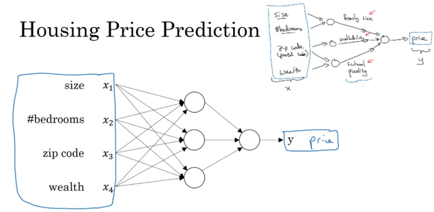
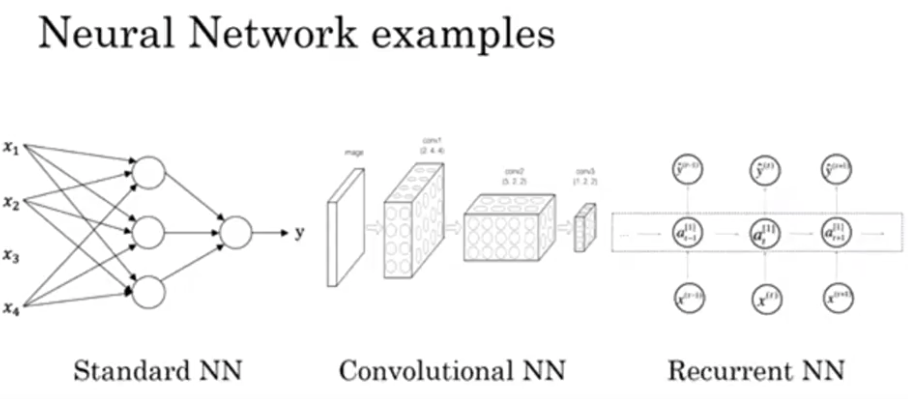
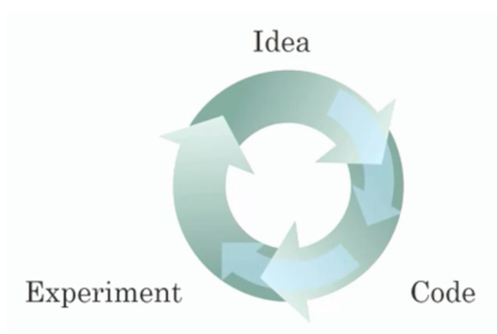
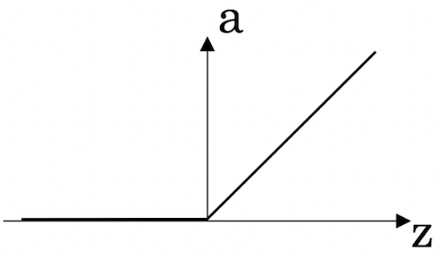

## Video 1: What is a Neural Network?

- Data set with housing prices and size of the house
- Create a function to predict price as a function of size of the house
- Simplest neural network: Size (x) -> Node -> Price (y)
  - The node, which is a _neuron_ implements the function of interest
  - Rectified Linear Unit (ReLU)
- We can make it a little more complicated:
  - Size & number of bedrooms  -> Node -> Family size
  - Zip code -> Node -> Walkability
  - Zip code & wealth -> Node -> School quality
  - All of these can be used to predict price

- This neural network is densely connected (all inputs are mapped to each hidden unit)
- Neural networks are very powerful at finding functions that accurately map $X \to Y$
- Most powerful in supervised learning settings

## Video 2: Supervised Learning with Neural Networks

- In supervised learning, you want to learn the mapping between an input (x) and an output (y)

Some examples:
- Standard NN:
  - Predicting home price as a function of home features
  - Predicting whether or not a user will click an ad
- Convolutional NN:
  - Great for images
  - Photo tagging given an image
- Recurrent NN:
  - Good for sequence data
  - Speech recognition
  - Machine translation
- Custom/hybrid:
  - ie; autonomous driving

- Neural network examples

Types of data:
- Structured data
  - think tables, where columns have defined meaning
- Unstructured data
  - for example: images, audio, or text

## Video 3: Why is Deep Learning Taking Off?

### Scale drives deep learning progress

1. Data
  - As the amount of data increases, the performance tapers off for traditional learning algorithms, such as SVM, logistic regression, etc.
  - Increasingly complex NN often get better and better performance
  - Need a lot of data for NN (especially for large NN)
  - Define (m) as the number of training examples
  - For small training sets, generally, hand generating features is more important and can yield better performance than NNs. However NN wins out in the big data regime.
1. Computation
  - We now have access to stronger computers
1. Algorithms
  - There has been great algorithmic discoveries as well
  - One of the algorithmic performance increases came from moving from sigmoid activation functions to ReLU.
    - There are regions in the sigmoid function where the derivative is essentially zero. Learning becomes slow (when using gradient descent methods) because the parameters will change very slowly.
    - Changing the activation function to ReLU, the gradient is (+1) for all positive inputts, which results in much faster gradient descent.

## Video 4: About this Course
- 4 weeks of content
- Quizzes with 10 multiple choice questions at the end of each week

## Reading 1: Frequently Asked Questions
- Basic course questions

## Video 5: Course Resources

- Discussion forum
- Contact: feedback@deeplearning.ai

## Reading 2: How to use Discussion Forums
- Skipped

___

## Quiz \#1: Introduction to Deep Learning

1. What does the analogy “AI is the new electricity” refer to?
  - Similar to electricity starting about 100 years ago, AI is transforming multiple industries.

2. Which of these are reasons for Deep Learning recently taking off? (Check the three options that apply.)
  - We have access to a lot more data.
  - Deep learning has resulted in significant improvements in important applications such as online advertising, speech recognition, and image recognition.
  - We have access to a lot more computational power.

3. Recall this diagram of iterating over different ML ideas. Which of the statements below are true? (Check all that apply.)
  - Being able to try out ideas quickly allows deep learning engineers to iterate more quickly.
  - Faster computation can help speed up how long a team takes to iterate to a good idea.
  - Recent progress in deep learning algorithms has allowed us to train good models faster (even without changing the CPU/GPU hardware).

4. When an experienced deep learning engineer works on a new problem, they can usually use insight from previous problems to train a good model on the first try, without needing to iterate multiple times through different models. True/False?
  - False

5. Which one of these plots represents a ReLU activation function?

6. Images for cat recognition is an example of “structured” data, because it is represented as a structured array in a computer. True/False?
  - False

7. A demographic dataset with statistics on different cities' population, GDP per capita, economic growth is an example of “unstructured” data because it contains data coming from different sources. True/False?
  - False

8. Why is an RNN (Recurrent Neural Network) used for machine translation, say translating English to French? (Check all that apply.)
  - It can be trained as a supervised learning problem.
  - It is applicable when the input/output is a sequence (e.g., a sequence of words).
  - RNNs represent the recurrent process of Idea->Code->Experiment->Idea->...

9. In this diagram which we hand-drew in lecture, what do the horizontal axis (x-axis) and vertical axis (y-axis) represent?
  - x-axis is the amount of data; y-axis is the performance of the algorithm

10. Assuming the trends described in the previous question's figure are accurate (and hoping you got the axis labels right), which of the following are true? (Check all that apply.)
  - Increasing the training set size generally does not hurt an algorithm’s performance, and it may help significantly.
  - Increasing the size of a neural network generally does not hurt an algorithm’s performance, and it may help significantly.

