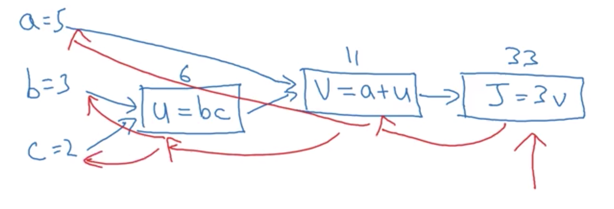
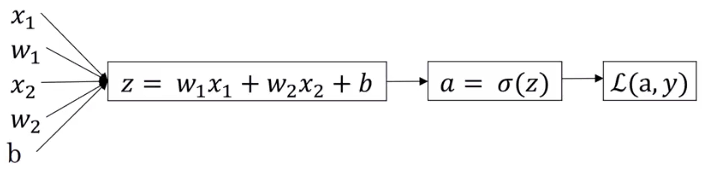

## Video 1: Binary Classification

Logistic Regression is an algorithm for binary classification
  - i.e. 1 (cat) or 0 (non cat)

In the cat example, suppose we had a 64x64 image comprised of 3 layers (R, G, B).
  - First un-row the layers and define $$x = [255, 231, ...]$$. That is, convert the original image of shape (64, 64, 3) into a single column vector of size $$n\equiv n_x = (64 \times 64 \times 3) = 12288$$
  - The logical process is then to discover the mapping $$x \to y$$

**Notation**

Each datum $$(x,y)$$, where $$x\in \mathbf{R}^{n_x}$$ and $$y \in {0, 1}$$, form an m-training set,

$$M_{train} = {(x^{(1)}, y^{(1)}), (x^{(2)}, y^{(2)})... (x^{(m)}, y^{(m)})}$$

Additionally, define $$X = [x^{(1)}, x^{(2)}, ... x^{(m)}]$$, which has $n$ rows and $m$ columns. That is to say, $$X \in \mathbf{R}^{n_x \times m}$$. Similarly, you should stack the outputs, $$Y = {y^{(1)}, y^{(2)}, ..., y^{(m)}}$$, where $$Y \in \mathbf{R}^{1 \times m}$$.

## Video 2: Logistic Regression

The goal is, given an input feature vector, $$x \in \mathbf{R}^{n_x}$$, and parameters $$w\in \mathbf{R}^{n_x}$$ and $$b \in \mathbf{R}$$, estimate $$\hat{y} = P(y=1 \mid x)$$, where $$\hat{y} \in [0, 1]$$.

An idea: $$\hat{y} = w^T \cdot x + b$$, which is sound for linear regression, but not binary classification. Instead, we would like $$\hat{y}=\sigma(w^T \cdot x + b)$$. The $$\sigma$$ corresponds to the sigmoid function, which has a functional form, $$\sigma(z) = \frac{1}{1 + e^{-z}}$$. Which has the following properties,

- In the limit, $$\lim_{z \to \infty} \sigma(z) = \frac{1}{1+0} = 1$$
- In the limit, $$\lim_{z \to -\infty} \sigma(z) = 0$$

## Video 3: Logistic Regression Cost Function

We defined, $$\hat{y} = \sigma(w^T \cdot x + b)$$, where $$\sigma(z) = \frac{1}{1+e^{-z}}$$.

Given $${(x^{(1)}, y^{(1)}), (x^{(2)}, y^{(2)})... (x^{(m)}, y^{(m)})}$$, we want to find the optimal parameters, $$w\in \mathbf{R}^{n_x}$$ and $$b \in \mathbf{R}$$, such that $$\hat{y^{(i)}} \approx y^{(i)}$$.

We need to define the **loss function**, $$\mathcal{L}(\hat{y}, y)$$.
- The squared residual may seam like an obvious choice, but not for logistic regression&dash;the optimiztion problem becomes non-convex, so it falls apart for gradient descent procedures.

Instead, we adopt,

$$\mathcal{L}(\hat{y}, y) = -(y\log \hat{y} + (1-y)\log (1-\hat{y}))$$

- If $$y=1$$: $$\mathcal{L}(\hat{y}, y) = -\log \hat{y}$$, want $$\hat{y} \to 1$$
- If $$y=0$$: $$\mathcal{L}(\hat{y}, y) = -\log (1-\hat{y})$$, want $$\hat{y} \to 0$$
- See the optional video for the reasoning behind this choice of loss function.

Additionally, we need to define a **cost function**, $$J$$, which measures how well we are doing over all training examples. Here it is defined as the average over the loss functions of all training examples.

$$\mathcal{J}(w,b) = \frac{1}{m} \sum_{i=1}^{m} \mathcal{L}(\hat{y}^(i), y^(i)) = -\frac{1}{m} \sum_{i=1}^{m} \left[ y^(i)\log \hat{y}^(i) + (1-y^(i))\log (1-\hat{y}^(i)) \right]$$

Note, the _loss function_ is applied to a single training example, and the _cost function_ is the cost of the parameters. So we would like to find parameters $w, b$ which minimize the cost function, $$\mathcal{J}$$.

## Video 4: Gradient Descent

To recap, we have defined $$\hat{y} = \sigma(w^T \cdot x + b)$$, where $$\sigma(z) = \frac{1}{1+e^{-z}}$$, and $$\mathcal{J}(w,b) = -\frac{1}{m} \sum_{i=1}^{m} \left[ y^(i)\log \hat{y}^(i) + (1-y^(i))\log (1-\hat{y}^(i)) \right]$$.

We want to find $w, b$ that minimize $$J(w, b)$$, and we choose to do so using gradient descent. This procedure attempts to traverse the surface of the cost function in the direction of the steepest descent, ultimately reaching the global optimum.

The pseudo-code is,
>Repeat {
>
>  w := $$w - \alpha \frac{\partial J(w, b)}{\partial w}$$
> 
>  b := $$b - \alpha \frac{\partial J(w, b)}{\partial b}$$
>
>}

 where $$\alpha$$ is the learning rate, and the derivative is the "update."

## Video 5: Derivatives

Intuition about derivatives:

- Suppose $$f(a) = 3a$$, then $$f(a=2)=6$$
- Further more, suppose we increase $$a$$ by an "infinitesimal" amount, $$\delta = 0.001$$, then $$f(a+\delta) = 6.003$$.
- We can conclude the _slope_ of $$f(a)$$ ($$\equiv \frac{d f(a)}{da}$$) is 3 about $$a=2$$.
- Of course, we would let $$\delta \to 0$$

## Video 6: More Derivative Examples

- Suppose we had the function $$f(a)=a^2$$, then $$f(a=2)=4$$
- Again, suppose we increase $$a$$ by $$\delta = 0.001$$, then $$f(a=2)\approx 4.004$$
- We can conclude the _slope_ of $$f(a=2)$$ ($$\equiv \frac{d f(a)}{da}$$) is 4
- However, in this example, the derivative is not constant across the domain.

$$\frac{d}{da} f(a) = \frac{d}{da} a^2 = 2a$$

Now, a slightly harder example,

- Suppose we had the function $$f(a)=\log_e(a)$$ ($$\equiv \ln(a)$$)
- $$\frac{d}{da} f(a) = \frac{1}{a}$$

## Video 7: Computation Graph

- Let's look at the function, $$J(a, b, c) = 3(a+bc)$$
- $$u=bc$$, $$v = a+ u$$, $$J=3v$$

- What we see is, from a left to right pass, we can compute the value of $$J$$ (blue lines)
- In order to compute the derivative, we need to go right to left (red lines)

## Video 8: Derivatives with a Computation Graph

Looking at the same function, 
- $$\frac{d J}{dv} = 3$$
- $$\frac{dJ}{da} = 3 = \frac{dJ}{dv} \frac{dv}{da} = 3 \cdot 1$$
  - Which is the chain rule
- $$\frac{dJ}{du} = 3 = \frac{dJ}{dv} \frac{dv}{du} = 3 \cdot 1$$
- $$\frac{dJ}{db} = \frac{dJ}{du} \frac{du}{db} = 3 \cdot 2 = 6$$
- $$\frac{dJ}{dc} = \frac{dJ}{du}\frac{du}{dc} = 3 \cdot 3 = 9$$

The most efficient way to compute the derivative is in a right to left fashion.

## Video 9: Logistic Regression Gradient Descent

Recall, logistic regression,

- $$z = w^T x + b$$
- $$\hat{y} = a = \sigma(z)$$
- $$\mathcal{L}(a, y) = - (y\log(a) + (1-y)\log(1-a))$$

As a computation graph,

Doing some derivatives,

- $$\frac{d \mathcal{L}}{da} = - \frac{y}{a} + \frac{1-y}{1-a}$$
- $$\frac{d \mathcal{L}}{dz} = a - y = \frac{d \mathcal{L}}{da} \frac{da}{dz} = - \frac{y}{a} + \frac{1-y}{1-a} \cdot a(1-a)$$
- $$\frac{d \mathcal{L}}{d w_1} = x_1 dz$$
- $$\frac{d \mathcal{L}}{d w_1} = x_2 dz$$
- $$\frac{d \mathcal{L}}{d b} = dz$$

We find,

- $$w_1 := w_1 - \alpha \frac{d \mathcal{L}}{d w_1}$$
- $$w_2 := w2 - \alpha \frac{d \mathcal{L}}{d w_1}$$
- $$b := b - \alpha \frac{d \mathcal{L}}{d b}$$

## Video 10: Gradient Descent on _m_ Examples

Recall,

$$J(w, b) = \frac{1}{m} \sum_{i=1}^{m} \mathcal{L}(a^{(i)}, y)$$

where $$a^{(i)} = \hat{y}^{(i)} = \sigma(z^{(i)})=\sigma(w^T x^{(i)} + b)$$

What we showed that for any training example, how to compute their derivatives ($$dw_1^{(i)}$$, etc). From there we can show that,

$$\frac{\partial J(w, b)}{\partial w_1} = \frac{1}{m} \sum_{i=1}^{m} \frac{\partial}{\partial w_1}\mathcal{L}(a^{(i)}, y)$$

Now, on $m$ examples,

> J=0; dw1 = 0; dw2=0; db=0
> 
> For i=1 to m:
> 
>   > $$z^{(i)} = w^T x^{(i)} + b$$
>   >
>   > $$a^{(i)} = \sigma(z^{(i)})$$
>   >
>   > $$J += -[y^{(i)}\log a^{(i)} + (1-y^{(i)}\log (1-a^{(i)})]$$
>   >
>   > $$dz^{(i)} = a^{(i)} - y^{(i)}$$
>   >
>   > $$dw_1 += x_1^{(i)} dz^{(i)}$$
>   >
>   > $$dw_2 += x_2^{(i)} dz^{(i)}$$
>   >
>   > $$db += dz^{(i)}$$
> 
> J /= m
> 
> dw1 /= m ; dw2 /= m ; db /= m

We find,

- $$w_1 := w_1 - \alpha \frac{\partial J}{\partial w_1}$$
- $$w_2 := w_2 - \alpha \frac{\partial J}{\partial w_2}$$
- $$b := b - \alpha \frac{\partial J}{\partial b}$$

Which isn't the most efficient, however we will learn how to speed this up with vectorization to remove explicit `for` loops.