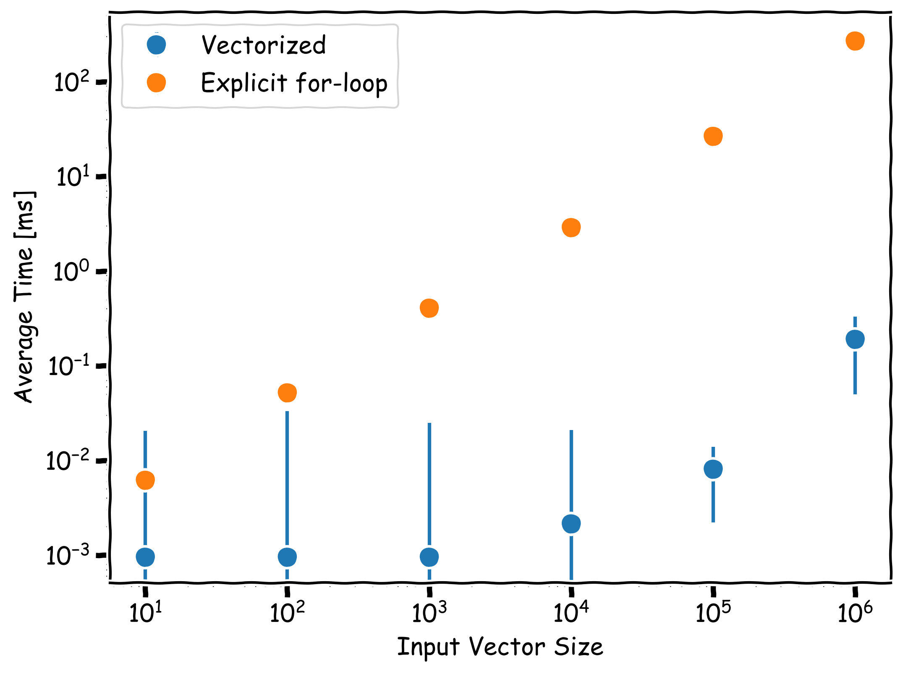

## Video 1: Vectorization

The goal of vectorization is to get rid of explicit `for` loops.

What is vectorization? In the logistic regression example, we want to compute $$z= w^T \cdot x + b$$, where $$x, w \in \mathbf{R}^{n_x}$$.

In the non-vectorized computation, one may do:

> z = 0
> for i in range(n_x):
>   > z += w[i] * x[i]
> z += b

...however, this is very slow. In the vectorized case we can do this much faster,

> z = numpy.dot(w, x) + b

```python
import numpy as np
import timeit
import astropy.units as u

a = np.random.rand(int(1e6))
b = np.random.rand(int(1e6))
```

Now, let's measure the performance using the numpy function `dot` to perform the dot product,

```python
start = time.time() * u.s  # specifying units of seconds

c = np.dot(a, b)

end = time.time() * u.s  # again, specifying units of seconds

print((start - end).to(u.ms))  # taking the difference, and converting to milliseconds
```

> 0.7920265197753906 ms

Similarly, we can also measure the performance using explicit `for` loops,

```python
start = time.time() * u.s  # specifying units of seconds

c = 0

for i in range(int(1e6)):
    c += a[i]* b[i]

end = time.time() * u.s  # again, specifying units of seconds

print((end - start).to(u.ms))  # taking the difference, and converting to milliseconds
```

> 367.8908348083496 ms

As we can already tell, there is already a massive speed boost. To make the point clearer, below is a figure where we inspect the average performance of each method for inputs of size $$[10^1, 10^2, 10^3, 10^4, 10^5, 10^6]$$&mdash;generated using `np.logspace(1, 6, 6)`. Each experiment was repeated for 1000 trials.



As a rule of thumb, it is generally a better practice to avoid explicit `for` loops&mdash;of course, there are examples where the opposite is true, or the performance boost is neglible.

## Video 2: More Vectorization Examples

Suppose we would like to compute the product of matrix, $$\mathbf{A}$$, and a vector $$\vec{v}$$, $$u = \mathbf{A}\vec{v}$. That is to say, $$u_i = \sum_j A_{ij} v_j$$. The pseudocode may look like,

```python
u = np.zeros((n, 1))

for i in ...:
  for j in ...:
    u[i] += A[i][j] * v[j]
```

However, by making use of vector operations, we can remove two explicit `for` loops,

```python
np.dot(A, v)
```


Suppose we have a vector, $$v = {v_1, ..., v_n}$$, and we want to apply the exponential operation on each element. The non-vectorized pseudocode may look like,

```python
u = np.zeros((n, 1))
for i in range(n):
  u[i] = math.exp(v[i])
```

Similary, using numpy, 

```python
import numpy as np
u = np.exp(v)
```

Let us recall the pseudocode for the logistic regression derivatives which used an explicit outer `for` loops, and one implicit inner `for` loop (across the vector $$dw$$).

> J=0; dw1 = 0; dw2=0; db=0
> 
> For i=1 to m:
> 
>   > $$z^{(i)} = w^T x^{(i)} + b$$
>   >
>   > $$a^{(i)} = \sigma(z^{(i)})$$
>   >
>   > $$J += -[y^{(i)}\log a^{(i)} + (1-y^{(i)}\log (1-a^{(i)})]$$
>   >
>   > $$dz^{(i)} = a^{(i)} - y^{(i)}$$
>   >
>   > for j=1 to n_x
>   >   > $$dw_j += x_1^{(i)} dz^{(i)}$$
>   >
>   > $$db += dz^{(i)}$$
> 
> J /= m
> 
> dw1 /= m ; dw2 /= m ; db /= m

Instead, let us do the following,

> J=0; dw=np.zeros((n_x, 1)); db=0
> 
> For i=1 to m:
> 
>   > $$z^{(i)} = w^T x^{(i)} + b$$
>   >
>   > $$a^{(i)} = \sigma(z^{(i)})$$
>   >
>   > $$J += -[y^{(i)}\log a^{(i)} + (1-y^{(i)}\log (1-a^{(i)})]$$
>   >
>   > $$dz^{(i)} = a^{(i)} - y^{(i)}$$
>   >
>   > $$dw += x^{(i)} dz^{(i)}$$
>   >
>   > $$db += dz^{(i)}$$
> 
> J /= m
> 
> dw /= m; db /= m

## Video 3: Vectorizing Logistic Regression

Accross `m`-training examples, we are interested in computing

$$z^{(m)} = w^T \cdot x^{(n)} + b$$

$$ a^{(m)} = \sigma(z^{(i)})$$

In order to carry out the forward propagation step (compute those predictions), we can do it without using explicit `for` loops.

Let us first define the matrix, $\mathbf{X}$, where each column vector is a training example,

$$\begin{bmatrix} \vdots & \vdots & \vdots & \vdots \\ x^{(1)} & x^{(2)}  &  \dots & x^{(m)} \\ \vdots & \vdots  & \vdots & \vdots \end{bmatrix}$$


First, to compute the row vector, $$\vec{Z} = [x^{(1)}, x^{(2)}, \dots, x^{(m)}]$$,

$$\vec{Z} = \mathbf{X} \cdot \vec{w}^T  + \vec{b}$$

Simiarly, we can compute $$\vec{A} = [a^{(1)}, a^{(2)}, \dots, a^{(m)}] = \sigma(z)$$

## Video 4: Vectorizing Logistic Regression's Gradient Output

Recall, we would like to compute $$dz^{(m)} = a^{(m)} - y^{(m)}$$. Assuming we cast $$a$$ and $$y$$ as vectors, we can easily compute $$\vec{dZ} = \vec{A} - \vec{Y}$$.

Furthermore, we can compute $$db = \frac{1}{n} \sum_{i=1}^{m} dz^{(i)}$$, which can be done in python as `1/m * np.sum(dZ)`. Additionally, $$dw = \frac{1}{m} X \cdot (dZ)^T$$

With this in mind, our code for logistic regression can be compressed into the following,

> Z = np.dot(w.T, X) + b 
>
> A = $$\sigma$$(Z)
> 
> dZ = A - Y
> 
> dw = 1/m * np.dot(X, dZ.T)
> 
> db = 1/m * np.sum(dZ)
> 
> w := w - $$\alpha$$ * dw
> b := b - $$\alpha$$ + db


Of course, if we would like to repeat this process across many iterations, we would still need an outer `for` loop.

## Video 5: Broadcasting in Python

Let us inspect this matrix of calories from carbs, proteins, and fats in 100 grams of different foods,

|  | Apples | Beef | Eggs | Potatoes |
| --: |  :--: | :--: | :--: | :--: |
| Carb | 56.0 | 0.0 | 4.4 | 68.0 |
| Protein | 1.2 | 104.0 | 52.0 | 8.0 |
| Fat | 1.8 | 135.0 | 99.0 | 0.9 |

Let's try to calculate a percentage of calories from carb, protein, and fat for each item without using explicit loops.

```python
import numpy as np
A = np.array([
  [56.0, 0.0, 4.4, 68.0],
  [1.2, 104.0, 52.0, 8.0],
  [1.8, 135.0, 99.0, 0.9]
])

print(A)
```
> INSERT OUTPUT


First, we can calculate the total calories for each food (along axis 0),

```python
cal = A.sum(axis=o)
print(cal)
```
> INSERT OUTPUT


Now, we can divide the calories from each macro by the total calories computed above (and of course multiply by 100), to return the percentages,

```python
percentage = np.int(100 * (A / (cal.reshape(1, 4)))
```
> INSERT OUTPUT


**Note**: I skipped the rest of the video, as it was especially trivial.

## Video 6: A Note on Python/Numpy Vectors

Since Python (and subsequently NumPy) is a very high level language, often bugs or strange behavior arise. To illustrate this example, let's inspect the construction of vectors.


```python
import numpy as np
a = np.random.rand(5)
print(a)
print(a.shape)
```

```python
[ 0.16028532  0.26050116  0.47725579  0.78783435  0.11175227]
(5,)
```

We can see `a` is a vector of shape `5,`. However, let us inspect do the following,

```python
a_t = a.T  # Transpose of a
print(a.shape)
```

As we can see, although we took the transpose of the vector, `a`, it is still the same "shape." However,

```python
print(a_t.dot(a))
```

Which, we would expected to be the outer product, $$\mathbf{a} \otimes \mathbf{a}^T $$, which would result in a matrix. Instead we returned the inner product, $$\mathbf{a}^T \cdot \mathbf{a}$$. Thus, to dispell any ambiguity, it is a good practice to ensure that you **do not** use vector of shape `(n,)` rather, explicity state the dimensionality of your vector,

1. Generate the vector `a` as a column vector initially,
```python
a = np.random.randn(5, 1)
print(a)
```
```python
[[ 0.80826514]
[-1.04093496]
[-0.87416568]
[ 0.63551704]
[-1.56180055]]
```

2. Utilize NumPy's reshape functionality,

```python
a = np.random.rand(5)
print(a)
print(a.shape)

a = a.reshape((-1,1))  # overwriting the variable "a"
print(a)
print(a.shape)
```
```python
[ 0.69486276  0.10728851  0.39289763  0.2724102   0.57769636]
(5,)
[[ 0.69486276]
 [ 0.10728851]
 [ 0.39289763]
 [ 0.2724102 ]
 [ 0.57769636]]
(5, 1)
```

Using one of those two options, we can verify the outer product behaves as expected,

```python
print(a.dot(a.T))
```

```python
array([[ 0.40056723,  0.31579331,  0.1899059 ,  0.31232705,  0.22886893],
       [ 0.31579331,  0.2489605 ,  0.14971523,  0.24622781,  0.18043233],
       [ 0.1899059 ,  0.14971523,  0.09003296,  0.1480719 ,  0.10850503],
       [ 0.31232705,  0.24622781,  0.1480719 ,  0.24352512,  0.17845184],
       [ 0.22886893,  0.18043233,  0.10850503,  0.17845184,  0.13076703]])
```

and, for the sake of completeness, the inner product,

```python
print(a.T.dot(a))
```

```python
array([[ 1.11938677]])
```

## Video 7: Quick Tour of Jupyter/ipython Notebooks
- skipped

## Video 8: Explanation of the Logistic Regression Cost Function (optional)

Recall, in the logistic regression, we were interested in computing $$\hat{y} = \sigma(w^T x + b)$$ where $$\sigma(z) = \left(1+e^{-z}\right)^{-1}$$. We would like to interpret $$\hat{y} = P\left(y=1 \mid x\right)$$. That is to say, if $$y=1$$, $$P\left(y \mid x\right) = \hat{y}$$; conversely, if $$y=0$$, $$P\left(y \mid x\right) = 1 - \hat{y}$$&mdash;as to preserve normalization.

In our example of binary classification, $$y$$ is only $$0$$ or $$1$$. If we would like to express the probability as a single expression,

$$\begin{align} P\left(y \mid x\right) &= \hat{y}^{0} \left(1-\hat{y}\right)^{(1-0)} + \hat{y}^{1} \left(1-\hat{y}\right)^{(1-1)} = 1 \cdot (1-\hat{y}) + \hat{y} \cdot 1 \\ &= \hat{y}^{y} \cdot \left(1-\hat{y}\right)^{(1-y)} \end{align}$$

Because the $$\log$$ function is a strictly monotonically increasing function, maximizing the $$\log P\left(y \mid x\right)$$ is yields a similar result to maximizig the $$P\left(y \mid x\right)$$. And if you compute this `log`,

$$\log P\left(y \mid x\right) = \log \hat{y}^{y} \cdot \left(1-\hat{y}\right)^{(1-y)} = y\log{\hat{y}} + (1-y)\log (1-\hat{y})$$

which is equivalent to $$- \mathcal{L}(\hat{y}, y)$$, which is the negative of the loss function presented previously. In logisitic regression, we wish to _minimize_ the loss function, hence the negative sign. That is to say, minimizing the loss function is equivalent to maximizing the $$\log$$ probability.

Recall that the loss function is used on *individual* training examples, however the cost function is used on the entire *set of training examples*. So,

$$\log P(\text{ labels in training set}) = \log \prod_{i=1}^{m} P\left(y^{(i)} | x^{(i)}\right)$$

assuming the samples are drawn Independent and Identically Distributed (IID), and recalling that maximizing the probability is same as maximizing the $$\log$$ probability. Thus,

$$\log P(...) = \sum_{i}^{m} \log P\left(y^{(i)} | x^{(i)}\right) = \sum_{i}^{m} - \mathcal{L}(\hat{y}^{(i)}, y^{(i)})$$

In statistics, in utilize the concept of _maximum likelihood estimation_, which is the idea of finding the optimal set of parameters which maximize this likelihood. Recall that we would like to *minimize* the cost function, $$J(w, b)$$, so we have to get rid of that minus sign, and for convinence, we scale this quantity by a factor $$m^{-1}$$. That is to say, minimizing the cost function, $$J(w,b)$$, is essentially equivalent to conducting maximum likelihood estimation.
